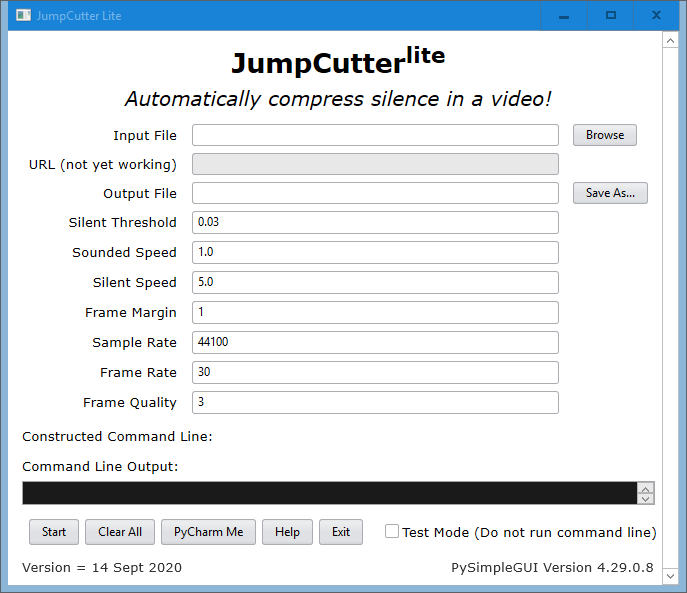

<h1 align="center">
  <b>JumpCutter</b><i>lite</i>
   
   
  </a>
   
   
</h1>

## What does this do?

It takes up space on your harddrive.  

No, seriously.  It's under construction and doesn't work yet!

## Windows

1. Install Rust.
2. Download [`sciter.dll`](https://github.com/c-smile/sciter-js-sdk/blob/main/bin/windows/x64/sciter.dll) and put it in this folder.
3. Download [`packfolder.exe`](https://github.com/c-smile/sciter-js-sdk/blob/main/bin/windows/packfolder.exe) and put it in this folder.
4. Run `cargo run` from a console window inside this folder.
